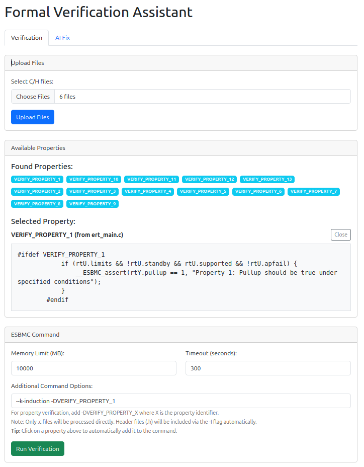
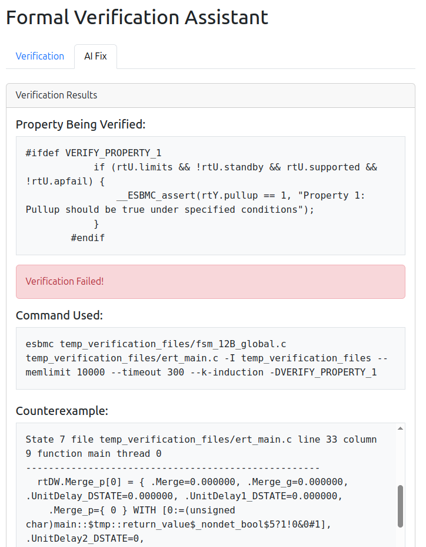
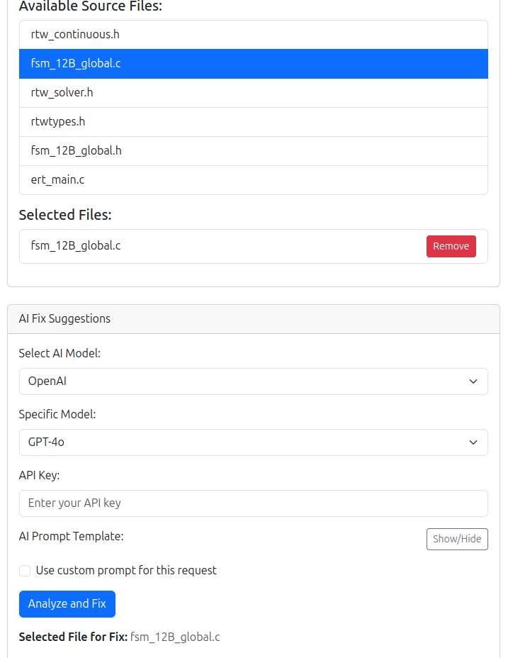

Here is used to record what I have done and how the UI looks like.

Currently, the AI fixing part is not working well. first the result is not catched as my expected. I can get the result print but failed to show it in the frontend.

Besides that, the repair is quite bad. It tried to fix the bug but just adding a lot of meaningless if statements. To specific, you know, that is not how bug fixing works.

[ESBMC_bug_fixing](https://github.com/LukeW1999/FuncLLM_esbmc)

I have just fixed the bug in the repair suggestion part but the performance is just too bad. DeepSeek and Claude are just trying to add a If statement to change to code to make it work instead of actually fixing the state transition.

It is really bad. But how to evaluate the fixing? If only based on the assertion properties, it may look like the fixing is correct. Holy Moly!

It is really hard to continue. I need to talk with my supervisors.